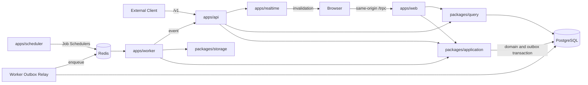
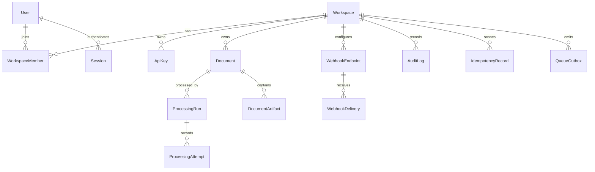
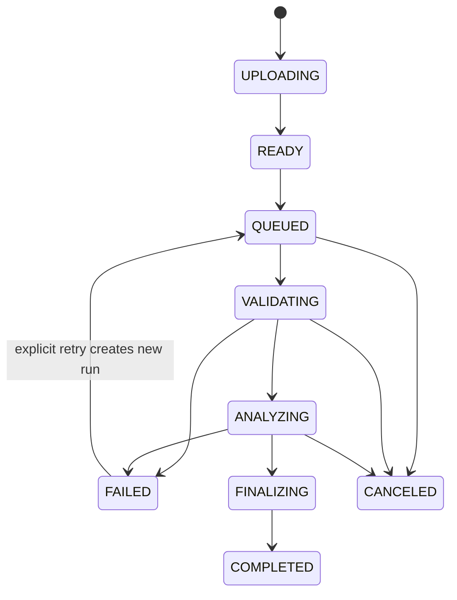

# Document Processing Hub Design

## Status

Approved design for changing `vkit-orbit` from a domain-neutral boilerplate into
a production-grade Document Processing Hub reference application.

## Goal

Build one complete application that proves the repository's architecture under
real product behavior. The application accepts text and Markdown documents,
processes them asynchronously, exposes progress and results to workspace users
and public API clients, and delivers completion webhooks.

The repository will no longer present an empty foundation or installable domain
recipe. All product paths are active, built, tested, and deployed by default so
that maintainers and AI agents can follow executable vertical slices rather than
copy instructions that can drift.

## Product Scope

The first product release supports `.txt` and `.md` files up to a configured
size limit. Processing is deterministic and produces a JSON report containing:

- SHA-256 checksum;
- character, word, and line counts;
- normalized title;
- extracted headings;
- estimated reading time;
- detected document structure.

OCR, AI, PDF parsing, and external processing providers are intentionally out of
scope. The product demonstrates infrastructure reliability without requiring
third-party credentials.

## Runtime Topology



PostgreSQL is the business source of truth. Redis and BullMQ provide at-least-
once delivery, scheduling, concurrency, and short-lived operational state. A
Redis loss must be recoverable from PostgreSQL.

## Runtime Ownership

### `apps/web`

`apps/web` is the customer-facing TanStack Start application and the only
browser business transport. It hosts same-origin tRPC at `/trpc`.

- Browser code uses one singleton tRPC client.
- Browser code never calls the public Elysia API.
- Browser code never imports database, application, queue, or server-secret
  modules.
- Server procedures derive workspace scope from the authenticated principal.
- Queries call one query service.
- Mutations call one application command.

Eden and Elysia are removed from the browser data path.

### `apps/api`

`apps/api` is a standalone public Elysia API. It owns:

- versioned `/v1` endpoints;
- API-key authentication and scopes;
- idempotency-key enforcement;
- OpenAPI and Scalar documentation;
- stable public error envelopes;
- liveness and readiness;
- the authenticated worker-event gateway;
- outbound publication to the realtime runtime.

It is not a proxy for `apps/web` and does not serve dashboard browser requests.

Each HTTP operation has exactly one file under
`apps/api/src/handlers/v1/<context>/`. Each file exports exactly one
`*Handler`, owns concrete schemas and OpenAPI metadata, and calls one application
command or query. Handlers do not import Prisma, Redis, BullMQ, or storage
clients. `apps/api/src/app.ts` is composition only.

### `packages/application`

This package owns mutations, transactions, invariants, state transitions,
idempotency records, queue-outbox creation, and audit records. It does not know
about tRPC, Elysia, BullMQ, Socket.IO, or HTTP.

### `packages/query`

This package owns reusable read-only queries with explicit workspace predicates,
bounded pagination, explicit selections, and JSON-safe DTOs. It never mutates
through Prisma.

### `packages/database`

This package remains the only Prisma client and migration owner. Infrastructure
records such as queue outbox, idempotency, sessions, API keys, audit records, and
webhook delivery history live alongside product data in PostgreSQL.

### `packages/queue`

This package owns:

- BullMQ queue names and versioned contracts;
- Zod payload validation;
- deterministic job-ID generation;
- Redis connection factories;
- retry, retention, concurrency, and scheduler defaults;
- producer and worker adapters;
- QueueEvents observability wiring.

It does not import Prisma or contain business handlers.

### `apps/worker`

The TypeScript worker owns the PostgreSQL outbox relay and BullMQ consumers.
Each job contract has one handler file. Handlers validate transport payloads,
load authoritative state, and invoke application commands. The worker exposes
private liveness and readiness endpoints and implements bounded graceful
shutdown.

### `apps/scheduler`

The scheduler installs BullMQ Job Schedulers using stable scheduler IDs. It does
not query Prisma or execute business logic. Scheduled jobs are ordinary worker
contracts that invoke application-owned recovery or cleanup commands.

### `packages/storage`

Storage is an S3-compatible boundary. Local Compose uses MinIO. Object keys are
generated by trusted server code and prefixed by workspace. BullMQ payloads
contain identifiers, never document bytes, signed URLs, or credentials.

### `apps/realtime`

Socket.IO carries invalidation signals only. A client receiving an event, or
reconnecting after an interruption, refetches authoritative tRPC data. The
baseline remains single-instance and does not install a Redis Socket.IO adapter.

## Identity and Authorization

Sessions use opaque random tokens. Browsers receive the plaintext token in a
host-only, HTTP-only, secure, `SameSite=Lax` cookie. PostgreSQL stores only the
token hash, expiry, revocation, user-agent, and IP metadata. Mutating same-origin
requests validate `Origin` and `Host`.

A user can belong to multiple workspaces. Feature code authorizes permission
codes rather than role names. Initial permissions are:

```text
documents:read
documents:write
documents:process
documents:cancel
api-keys:manage
webhooks:manage
audit:read
workspace:manage
```

Initial roles are `OWNER`, `ADMIN`, `MEMBER`, and `VIEWER`. Important database
relations use workspace-qualified keys or constraints to prevent cross-workspace
references. Browser and public API inputs never provide the authoritative
workspace scope.

## Domain Model



`Document` owns identity and source metadata. `ProcessingRun` is the
authoritative processing lifecycle. `ProcessingAttempt` records worker attempts
and outcomes. `DocumentArtifact` represents source and generated report objects.
Retries create a new processing run instead of overwriting failed history.

## Upload Lifecycle

1. A client creates an upload intent.
2. The server creates an `UPLOADING` document and returns a short-lived signed
   upload URL.
3. The client uploads directly to S3-compatible storage.
4. The client confirms the upload.
5. The server performs a bounded `HEAD` request, validates metadata, and marks
   the document `READY`.

Final object keys are generated server-side:

```text
workspaces/{workspaceId}/documents/{documentId}/source/{artifactId}
```

## Processing Lifecycle



Processing uses short, resumable stage jobs:

```text
document.validate.v1
document.analyze.v1
document.finalize.v1
webhook.deliver.v1
document.recover.v1
document.cleanup.v1
notification.publish.v1
```

Each successful stage transition and its next queue intent commit in one
PostgreSQL transaction. The implementation does not rely on BullMQ Flow as the
business workflow source of truth.

Every stage:

1. parses the versioned payload;
2. loads the run by ID and workspace-owned relation;
3. checks expected state and stage revision;
4. claims a short processing lease;
5. releases the database transaction;
6. performs bounded work;
7. commits the outcome and next-stage outbox;
8. creates a notification intent after a visible state change.

Stale revisions and already-completed stages are safe no-ops.

## Progress and Realtime

Processing stores milestone progress only:

```text
10 upload verified
25 validation completed
60 analysis completed
90 report stored
100 finalized
```

After commit, the worker delivers a stable event through the Elysia worker-event
gateway. A representative event is:

```json
{
	"type": "document.processing.updated",
	"eventId": "evt_...",
	"workspaceId": "ws_...",
	"documentId": "doc_...",
	"runId": "run_..."
}
```

The event contains identifiers for invalidation, not report data.

## Web tRPC Surface

The initial routers are `auth`, `workspace`, `documents`, `processingRuns`,
`apiKeys`, `webhooks`, and `audit`.

Representative procedures:

```text
auth.register
auth.login
auth.logout
auth.session
documents.createUpload
documents.confirmUpload
documents.list
documents.get
documents.submitProcessing
documents.cancelProcessing
documents.retryProcessing
documents.getResultDownload
apiKeys.list
apiKeys.create
apiKeys.revoke
webhooks.list
webhooks.create
webhooks.update
webhooks.rotateSecret
webhooks.delete
audit.list
```

Procedure classes are `publicProcedure`, `authenticatedProcedure`,
`workspaceProcedure`, and `permissionProcedure(permissionCode)`.

## Public Elysia API

The first public surface is:

```http
POST /v1/document-uploads
POST /v1/documents/:documentId/upload-confirmations
POST /v1/documents/:documentId/processing-runs
POST /v1/processing-runs/:runId/cancellations
POST /v1/processing-runs/:runId/retries
GET  /v1/documents
GET  /v1/documents/:documentId
GET  /v1/processing-runs/:runId
GET  /v1/processing-runs/:runId/result
GET  /health/live
GET  /health/ready
GET  /openapi.json
GET  /docs
```

API keys have a public prefix and a hashed secret, plus workspace, scopes,
expiry, revocation, and last-used metadata. Initial scopes are
`documents:read`, `documents:write`, and `documents:process`. Plaintext secrets
are returned only once.

Public resource-creating mutations require `Idempotency-Key`. Records are
scoped by workspace and operation and store a canonical request hash and result
locator. Reusing a key with the same payload returns the original result;
reusing it with a different payload returns `409 IDEMPOTENCY_CONFLICT`.

Public errors use a stable envelope:

```json
{
	"error": {
		"code": "DOCUMENT_NOT_FOUND",
		"message": "Document was not found",
		"requestId": "req_..."
	}
}
```

Validation errors may add a bounded `issues` array. Internal exceptions, SQL,
storage keys, Redis details, stack traces, and credentials are never exposed.

## Result Downloads

Result authorization verifies workspace ownership and a completed run, then
returns a short-lived signed URL. The API does not proxy result bytes and never
returns a permanent storage credential or raw object key.

## Webhooks

Initial events are:

```text
document.processing.completed.v1
document.processing.failed.v1
```

The event ID and serialized UTF-8 envelope are stored once. Every retry sends
identical bytes. Delivery uses HMAC signatures, explicit attempt history,
bounded exponential backoff, and retryable, terminal, or unknown outcomes.

## Queue Topology

Queues are separated by workload:

```text
document-processing
webhook-delivery
maintenance
notifications
```

Each contract and each worker handler has one file. Deterministic IDs include
the contract name, immutable business ID, and stage revision. BullMQ IDs provide
practical duplicate suppression; database constraints and state guards provide
permanent correctness.

## Transactional Queue Outbox

Domain state and queue intent commit atomically. The relay claims bounded
batches with short leases and `FOR UPDATE SKIP LOCKED`, commits the claim, then
contacts Redis. It never holds a PostgreSQL lock across Redis I/O.

Outbox status is `PENDING`, `CLAIMED`, `PUBLISHED`, or `FAILED`. Records include
queue name, contract, deterministic job ID, payload, availability time, claim
expiry, publish attempts, publication time, correlation ID, and last error.

A relay crash after `queue.add()` and before marking `PUBLISHED` is safe because
the retry uses the same job ID. Retention must exceed the outbox claim and normal
recovery horizons.

## Retry Ownership

One failure class has one retry owner.

BullMQ owns retries for safe deterministic processing, process crashes, temporary
storage connectivity, Redis disconnects, and temporary internal notification
failure. PostgreSQL business state owns webhook schedules, processing leases,
ambiguous external outcomes, business conflicts, and operator-initiated retries.

Webhook jobs perform one durable delivery attempt. A retryable result writes
`nextAttemptAt` and a new delayed outbox intent. The current BullMQ job then
completes. This prevents Redis from becoming the only record of a future retry.

Every handler returns or records one of:

```text
SUCCESS
NO_OP
RETRYABLE
TERMINAL
UNKNOWN
```

`UNKNOWN` is used when an external side effect may have succeeded but no result
is known. Blind retry is forbidden unless the external operation has a stable
idempotency key.

BullMQ completion means only that the processor returned successfully. It never
means that a document or webhook reached a business terminal state.

## Redis Durability

The local and self-hosted baseline uses:

```conf
appendonly yes
appendfsync everysec
maxmemory-policy noeviction
```

Redis has a persistent volume, health check, pinned image, and no default host
port. It is not used as a general-purpose cache. Production documentation covers
authentication, TLS, replication or managed Redis, backups, disk alerts, and
memory alerts.

## Redis Loss Recovery

Recovery scans PostgreSQL for non-terminal runs, expired leases, due webhook
attempts, and queue intents that did not reach a durable business outcome. It
creates deterministic outbox intents for the current stage and revision.

This supports reconstruction after complete Redis loss. Completed or canceled
runs remain no-ops even if an old job is replayed.

## Scheduler

Stable BullMQ Job Schedulers enqueue:

- processing recovery;
- webhook retry recovery;
- expired upload cleanup;
- result retention cleanup;
- queue/outbox health sampling where needed.

The scheduler does not read product tables. The worker invokes bounded
application commands for every scheduled operation.

## Graceful Shutdown

On termination, the worker marks readiness false, stops outbox polling, stops
accepting new jobs, awaits active handlers within a configured timeout, closes
QueueEvents and queue objects, quits Redis connections, disconnects Prisma, and
closes its private health server. The scheduler follows the same pattern without
business database ownership.

## User Interface

The route structure is:

```text
/
|-- sign-in
|-- register
`-- app
    |-- overview
    |-- documents
    |   |-- new
    |   `-- $documentId
    |       `-- runs/$runId
    |-- developers
    |   |-- api-keys
    |   `-- webhooks
    |-- activity
    `-- settings
        |-- workspace
        `-- members
```

The primary flow is login, upload, confirm, submit, observe progress, inspect
the report, and download the result. Failed runs offer an explicit retry that
creates a new run.

The UI uses the existing Tailwind and shadcn foundation as a document workbench,
not a generic card-grid dashboard. It provides explicit loading, empty,
permission-denied, not-found, conflict, dependency-unavailable, and success
states. Tables become compact lists on small screens. Keyboard interaction,
visible focus, reduced motion, and WCAG AA contrast are required.

## Observability

Request and job logs carry bounded, structured fields including service,
environment, request and correlation IDs, workspace and principal identifiers,
document and run identifiers, queue, contract, job ID, attempt, duration,
outcome, and safe error code.

The redactor removes authorization headers, cookies, API keys, webhook secrets,
signed URL queries, raw document content, storage credentials, Redis URLs, and
database URLs.

Metrics cover HTTP latency and status, queue depth and oldest age, stalled jobs,
outbox depth and age, stage duration, processing outcomes, recovery counts,
webhook outcomes, storage latency, and cleanup failures.

Audited actions include authentication, upload creation and confirmation,
processing submission, cancellation and retry, result-download authorization,
API-key lifecycle, webhook lifecycle, and workspace membership changes.

## Testing

Unit tests cover schemas, deterministic IDs, state transitions, idempotency,
retry classification, workspace scope, stale-revision no-ops, error mapping,
and redaction.

PostgreSQL integration tests cover atomic domain/outbox writes, rollback,
cross-workspace isolation, concurrent idempotency, leases, immutable webhook
payloads, and transactional audits.

PostgreSQL plus Redis Testcontainers tests cover relay crash windows, concurrent
relays, duplicate execution, stalled recovery, backoff, delayed stale revisions,
Redis restart with AOF, full Redis-loss reconstruction, webhook byte identity,
and graceful shutdown.

Contract tests enforce one Elysia handler per operation, endpoint and OpenAPI
parity, concrete schemas, security declarations, secret exclusion, tRPC router
inventory, and the absence of browser `/v1` calls.

Focused browser tests cover login, upload, processing progress, result download,
failed-run retry, API-key management, and webhook management.

## Deployment

Compose includes PostgreSQL, Redis, MinIO, one-shot migration, web, public API,
worker, scheduler, and realtime services. Web and API wait for migration
completion. Worker waits for migration, Redis, and storage readiness. Scheduler
waits for Redis. Only intended public ports are published.

CI runs formatting, linting, type checks, architecture checks, unit tests,
Testcontainers integration tests, all runtime builds, Compose validation,
Compose smoke tests, and `git diff --check`.

## Runbooks

The product includes actionable runbooks for Redis recovery, stuck processing,
webhook delivery, PostgreSQL recovery, storage recovery, and incident triage.
Each runbook documents symptoms, impact, diagnosis, containment, recovery,
verification, and stop or rollback conditions.

## Explicit Non-Goals

- OCR, PDF, or DOCX parsing;
- AI or LLM processing;
- malware scanning;
- document collaboration or editing;
- full-text document search;
- billing or usage charging;
- a separate backoffice runtime;
- multi-region deployment;
- Redis Cluster in the baseline;
- a multi-node Socket.IO adapter;
- arbitrary user-authored workflows or processing code;
- Restate-style durable code replay;
- exactly-once external side effects;
- a public BullMQ dashboard;
- compatibility layers for River, Go workers, Eden browser clients, or the old
  domain-neutral baseline.

## Success Criteria

1. Browser users complete the document lifecycle through same-origin tRPC.
2. External clients complete the same lifecycle through Elysia `/v1`.
3. Domain mutations and queue intents commit atomically.
4. Worker restarts do not lose or duplicate business transitions.
5. Duplicate jobs do not create duplicate result artifacts.
6. A complete Redis loss can be recovered from PostgreSQL.
7. Webhook retries preserve byte-identical payloads.
8. Realtime reconnect produces correct state through tRPC refetch.
9. Cross-workspace access fails at query, mutation, storage, and public API
   boundaries.
10. A fresh checkout runs the complete stack and integration suite through the
    Taskfile.
